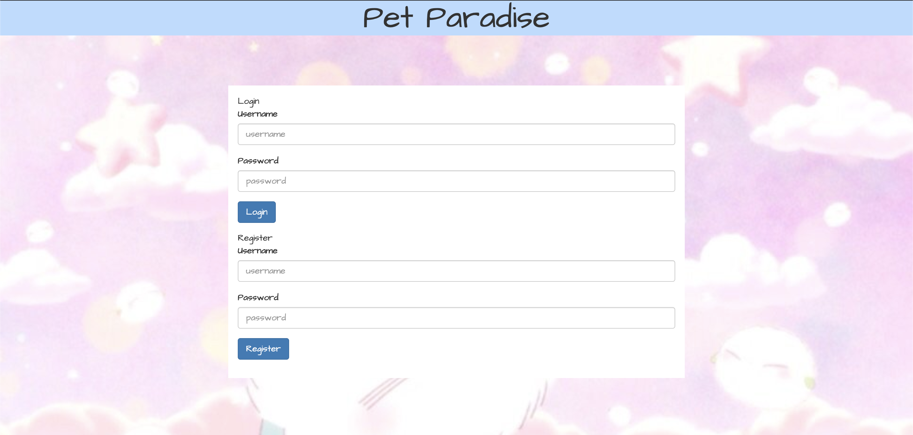
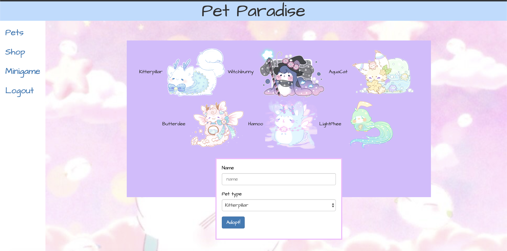
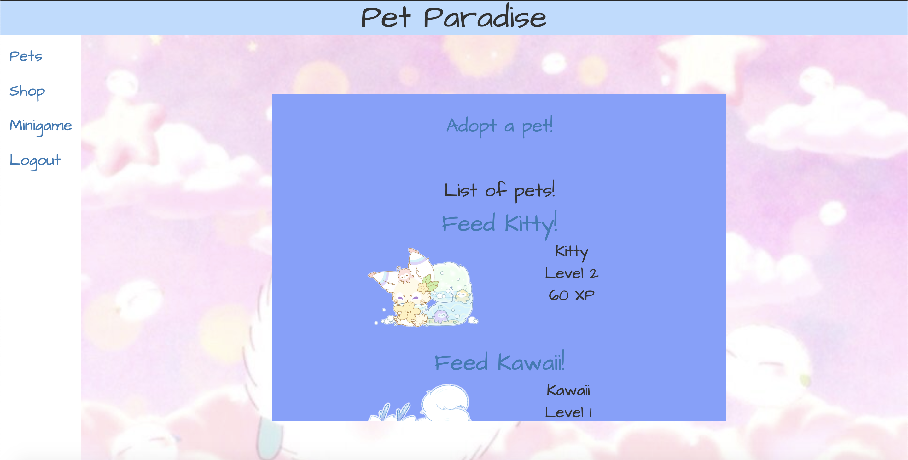
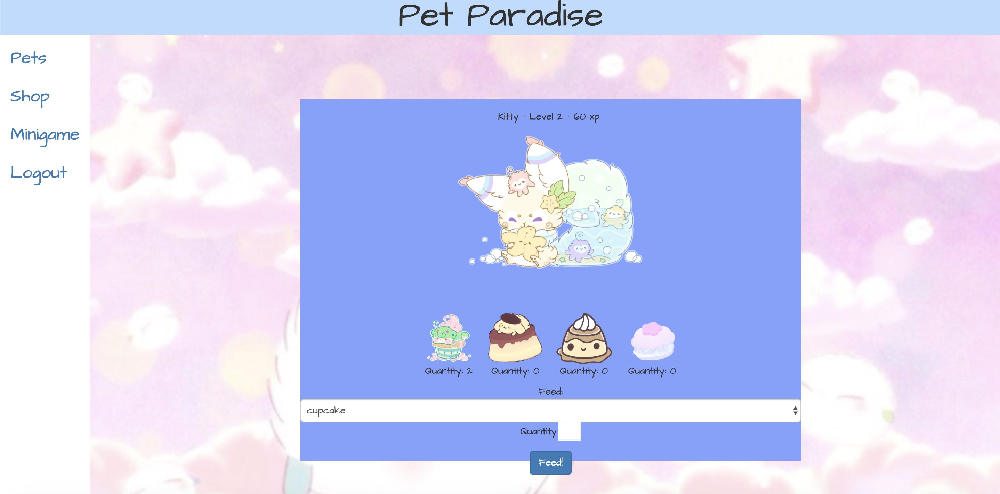
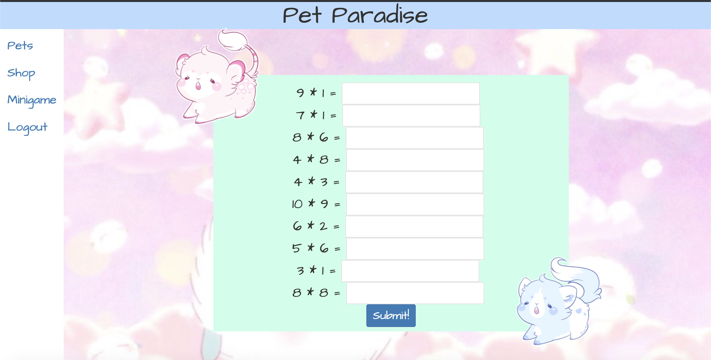
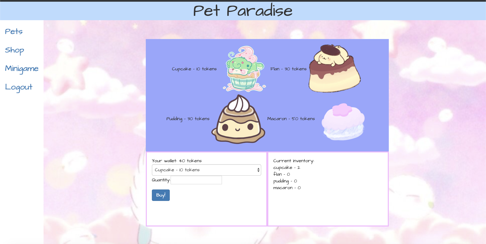
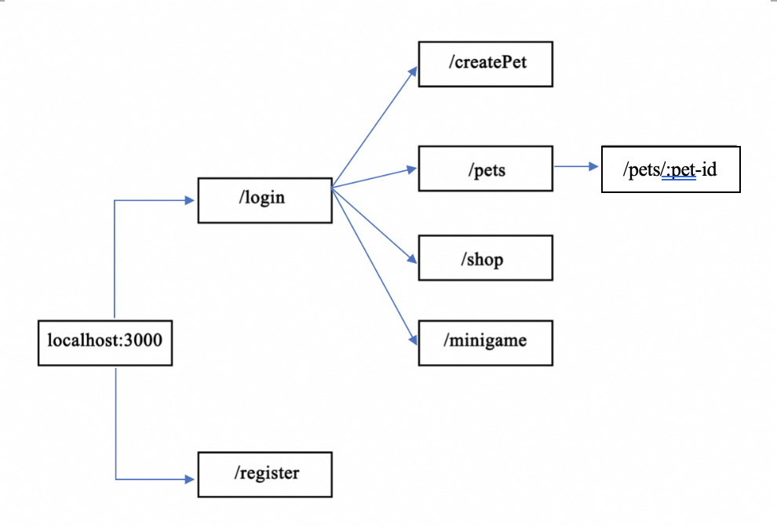

# Pet Paradise 

## Overview

Sometimes, you want to take care of a pet but you're scared of not being able to do a good job. Or maybe, you have allergies and can't take care of one. Don't fret, Pet Paradise is here! Pet Paradise is a web app that will allow users to take care of a virtual pet. Users can register and login to take care a variety of pets of their choosing! After logging in, they can add new pets or feed their pets to level up. Users can also earn coins from playing games to shop for food for their pets!


## Data Model

The application will store Users, Pets, PetFood

* users can have multiple pets
* Each pet has an owner (using user's name)
* Each pet food also has an owner 


An Example User:

```javascript
{
  username: "petlover",
  password: // a password,
  wallet: // amount of tokens a user has
}
```

An Example Pet:

```javascript
{
  owner: // user's name of who owns the pet
  name: "Chirpy",
  level: 5,
  type: "LightPhee"
  xp: 7
}
```

An Example PetFood:

```javascript
{
  username: // user's name of who has this item
  name: 'dragonFire',
  xp: 200, 
  cost: 30,
  quantity: 5
}
```

## [Link to Commented First Draft Schema](db.js) 


## Wireframes

/register - page for registering an account



/createPet - page for creating a new pet



/pets - page for showing all pets



/pets/:pet-id/feed - page for feeding a pet



/minigame - page for playing a minigame to earn coins



/shop - page for buying pet food



## Site map



## User Stories or Use Cases

1. As non-registered user, I can register a new account with the site.
2. As a user, I can log in to the site.
3. As a user, I can create and choose a new pet to take care of.
4. As a user, I can view all of the pets I own in a list.
5. As a user, I can buy food from a pet food shop.
6. As a user, I can feed a pet food to level it up.
7. As a user, I can play mini-games to earn coins to use at the shop.

## Research Topics

* (5 points) Automating and integrating ESLint using grunt or gulp
    * Grunt and gulp involves automating processes to help decrease the amount of manual work.
      * Automation is a key concept in DevOps. So, instead of running tests or a linter repetitively by hand, automating it saves time.
* (3 points) Performing client side validation using jQuery
    * jQuery validation is a jQuery plugin used to validate forms
    * If forms have requirements, such as min or max length, then jQuery can check the invalid inputs and report them
* (5 points) Concatenation and minification of CSS and JavaScript files using grunt and webpack
    * Minifying helps load the browser faster
    * Concatenation of the JS files is used for React since entry points are used

13 points total out of 8 required points


## [Link to Initial Main Project File](app.js) 

## Annotations / References Used
* https://jqueryvalidation.org/documentation/
* https://jqueryvalidation.org/jQuery.validator.addMethod/ - referenced for how to style my own validator
* https://webpack.js.org/concepts - for learning how to concatenate and minify the JS files for React
* https://getbootstrap.com/docs/4.3/getting-started/introduction/ - for navbar and forms
* https://github.com/gruntjs/grunt-contrib-cssmin - learning how to minify css using grunt